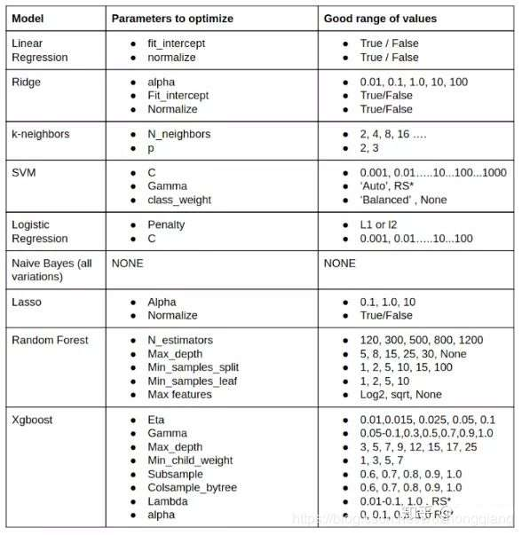

# 数据挖掘比赛知识整理

datawhale教程

[官方总结](https://mp.weixin.qq.com/s/7ORyiSRb5OY3CDedZadPfA)

[EDA](https://mp.weixin.qq.com/s/IOlHIEIQhuIaubTeP4o39w)

[特征工程](https://mp.weixin.qq.com/s/A2vChdNXRqlddyIY0iJ3zQ)

[建模调参](https://mp.weixin.qq.com/s/cXSRcMk_0t8RxSaKb0sHww)

[模型融合](https://mp.weixin.qq.com/s/fsT6rzpL5cuzh2usNjzzbA)

---
## 赛题理解

### 理解特征
首先要理解特征的业务意义，比如空缺值是的确因为数据空缺还是有他本身的业务意义、汽车品牌对价格的影响、地区编码前三位对应的大的地区比较有意义等等

### 数据量

对数据量的大小、种类要有明确的认识，比如数据量大适合神经网路，对于SVM/SVR这类就不太适合，数据量小树模型更加能work，对于图像、音频等感知型数据神经网络特别擅长

### 背景理解

要考虑手头的数据做出来的模型有没有泛化性，对于数据中的

1. 数据异常
2. 数据缺失
3. 数据漂移
4. 用户逻辑异常（现实情况）

对于异常缺失，LR/SVM模型非常敏感，但是xgb、lgb都会自动处理缺失值，决策树会把缺失值单独分为一类。后期可以通过EDA来分析特征、筛选特征、填补异常缺失值

### 赛制理解

注意截止时间，AB榜单（两个问题或者两个数据集），工业比赛中的模型融合次数、运行时间限制

### 常用方法

xgboost、深度学习、lgboost都是现代比赛常用的方法

调参可以使用网格搜索，比较快速的有贝叶斯调参等

自动机器学习（AutoML）有微软开源的NNI等

机器学习生命周期（开发、训练、迭代、部署）管理有MLflow、google的Kubeflow等

### 评价指标

评价指标丰富多样，有MAE、MSE、RMSE、R2等等每个指标可能对模型融合方法敏感性各异

### 比赛流程

团队参赛基本流程一般是

1. 初步修改baseline提交看得分
2. 分析、调参
3. 多人合作、模型融合

---
## 特征工程&EDA(探索性数据分析)

传统机器学习算法例如树模型、几何模型质量好坏几乎取决于特征工程好坏，但是像深度学习技术只需要数据量纲一致、分布合理即可，这也是DL大热的原因

### 数据变换
这里针对连续性特征即定距特征（大小差值均有意义）

数据变换是很重要的一点，因为

1. 许多传统机器学习模型例如LR都要求数据独立同高斯分布
2. 放大差异，利于模型学习：独立同分布要求变量之间相互独立

#### 数据形态分布变换

1. Box-cox变换：
   自动将数据从各个心态变为高斯分布，详见知乎
2. 其他变换，例如：log、平方、幂...
   
#### 标准化变换

1. 归一化：zscore等
   同一量纲对于LR等模型来说也是非常重要的

#### 类别特征变换

##### 定类特征
定类特征数值是名义型特征，大小和插值均无意义

**特别推荐：**

   - [特征编码方法总结1](https://zhuanlan.zhihu.com/p/67475635)
   - [特征编码方法总结2](https://zhuanlan.zhihu.com/p/68259539)

1. 类别少<10进行独热（one-hot）编码
2. 类别多可以进行聚类后再one-hot，也可以使用embedding的方法：
   embedding也是内容十分丰富的知识点，作品有例如DBN、自动编码器等，感兴趣可以深入研究，这个思想和cv中利用CNN形成的feature map作为特征进行图像检索、nlp中word2vec非常相似。另外也可以进行推广，对非类别特征也可以进行embedding，这个思维就类似从CNN中提取feature map，只不过被编码的不是图像，而是结构化数据（一般将与目标字段相关性较低的数据维度进行embedding降维编码，这样避免了数据的浪费）

##### 定序特征
定序特征按特性排序，大小有意义，差值无意义

1. 定序编码（之后最好再归一化）
2. 也可以进行聚类、embedding

### 异常值处理

1. 3σ法则

   - 数量少可以直接删除
   - 数量多或者有影响可以截断或者统计值替换

2. 箱型图、小提琴图分析
   
### 缺失值处理

1. 对xgb、lgb、tree model不处理
2. 缺的字段太多，直接删除
3. 插值（拉格朗日插值法、统计值填充法、模型预测法（聚类等方法））
4. 分箱处理
   
### 数据分桶

1. 等频、等距分桶
2. Best-KS分桶
3. 卡方分桶

### 特征构造

1. 统计量构造
2. 类别构造（交叉组合/embedding编码）\
   某字段类型替换为按该字段groupby的某特征的统计量，这样既构造了特征，又将两列特征变为一列
3. 时间序列（移动平均、同日期统计值）这也是研究热点难点，可以深入研究

   - [应用时间序列分析(何书元).pdf](./docs/应用时间序列分析(何书元).pdf)
   - [金融时间序列分析.pdf](./docs/金融时间序列分析.pdf)

4. 多项式回归（对线性相关性较低，但是弃之可惜的特征字段）

   - 另外基于双线性回归的思想，可以直接选择FM/FFM模型

   https://www.jianshu.com/p/1db7404689c5

### 特征选择

#### 过滤法
根据方差（方差大的信息多）、相关性（与目标字段相关的特征重要）选择特征。具体方法：
   
- 排除低方差特征（类别严重偏移，或者分布集中的连续特征）
- 排除冗余特征（两个特征间过相关）
- 选取高相关特征
- 连续特征相关系数使用spearman
- 离散特征相关性使用卡方检验
#### 包装法（包裹式）
根据算法偏好选择好的特征，可以作边际图探索特征的边际效应
   
 - xgb选择
 - 树模型选择（RF）
 - 关联规则等选择后构造特征（啤酒尿布）
#### 嵌入法
通过正则化训练模型，过滤出重要性高的特征

实践中优先选择包装法，效果比较好

#### PCA降维

PCA有三步：
1. 归一化标准化
2. 平移正交基   
   通过协方差矩阵计算出特征值最大的特征向量    
   将数据投影到该特征向量上   
3. 砍掉方差较小的纬度   

这个方法可以运用于特征太多容易造成维度灾难的情况，但是得出的矩阵不可解释，有一部分信息损失

用左奇异矩阵做PCA可以对行信息进行压缩，右奇异的PCA对特征维度进行压缩

---

## 建模调参

常用模型参数范围

---

## 模型融合

1. 加权融合
2. stacking融合

K折交叉验证步骤：

1. Train Data ------KFold------>k个模型 + 由k个模型交叉预测出的Train Data New
2. 由Train Data New训练出新模型 M0
3. Train Data ------KFold------>由第一步中k个模型交叉预测出Test Data New
4. 最终结果 Predict = M0(Test Data New)

KFold可以有效避免过拟合和数据泄露的问题，是模型融合和embedding中的常用方法

另外时序问题不能用将来的数据去预测过去，所以有独特的数据切分验证方法

---

# 其他

## 建模比赛要点

1. 理念符合政策
2. 建模目标明确
3. 数据符合客观
4. 数据回滚部署

## 时间序列工具

1. [prophet](https://mp.weixin.qq.com/s/smjRKQ-JntGTwCDCUS61GQ
)

## 数据挖掘工具

https://mp.weixin.qq.com/s/hhEibJNvt9rsMrKoG7BHig

1. janitor（数据清理工具）
2. pivottable-js:pands（js版数据透视表）
3. dabl（可视化数据探索）
4. knock knock（发送通知到mobile desktop email）
5. [jupyterlab](https://www.cnblogs.com/feffery/p/13692800.html) elyra（jupyter工作流）
6. [pandas gui](https://zhuanlan.zhihu.com/p/269379379)（可视化操作pandas）
7. [pandas_alive](https://mp.weixin.qq.com/s/QdGuTJHvqPWp1XCKooMc3g) （动态可视化数据变化图）
   

## 推荐系统工具

1. [RecBole](https://mp.weixin.qq.com/s/LmAtKi3QI71JHZRZWJMTVw) 基于Pytorch的推荐系统开源库