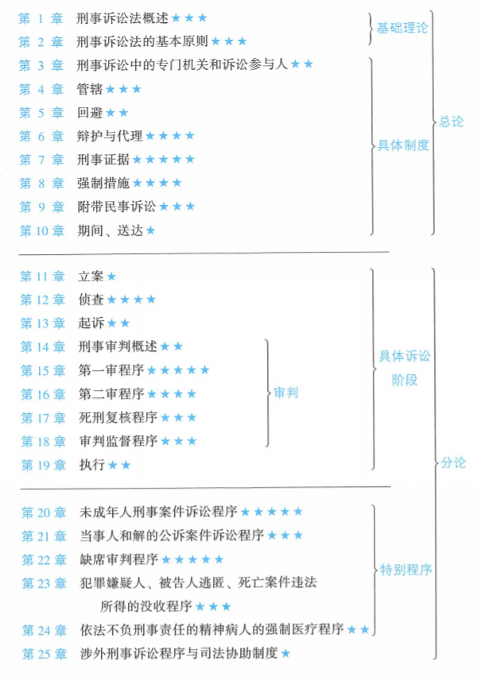

# 法考

## 刑事诉讼法

**教参-刑诉向高甲强化**   
链接:https://pan.baidu.com/s/10IdGg-_woDpMUI5caSzBPA 提取码:1897

1. '
2. '
3. '
4. '
5. '
6. '
7. [刑事证据制度](./刑事诉讼法/7.刑事证据制度.md)
8. [强制措施](./刑事诉讼法/8.强制措施.md)
9. [附带民事诉讼](./刑事诉讼法/9.附带民事诉讼.md)
10. [期间](./刑事诉讼法/10.期间.md)
11. [送达](./刑事诉讼法/11.送达.md)
12. [立案](./刑事诉讼法/12.立案.md)
13. [侦查](./刑事诉讼法/13.侦查.md)
14. [起诉](./刑事诉讼法/14.起诉.md)
15. '
16. '
17. '
18. '
19. '
20. '
21. '
22. '
23. '
24. '
25. '

