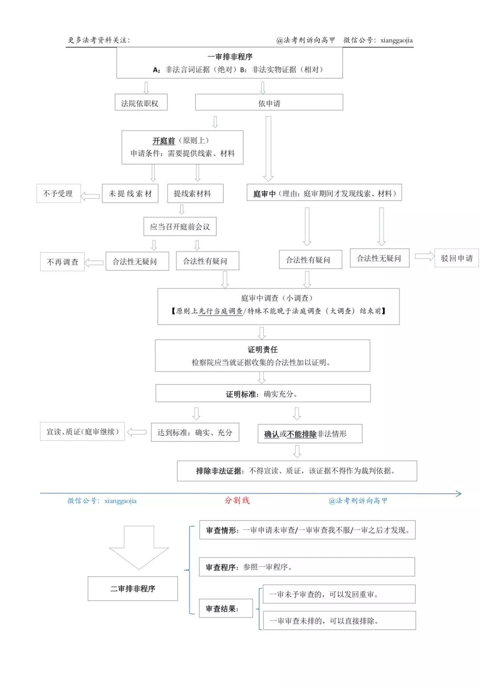

# 刑事证据制度✨✨✨✨✨

## 刑事证据
证据是一种材料，八种证据：
（一）物证；（二）书证(表达内容或思想，案发中形成)；（三）证人证言（共犯内叫口供，共犯外叫证人证言）；（四）被害人陈述；（五）犯罪嫌疑人、被告人供述和辩解（口供）；（六）鉴定意见(有异议有必要人才出庭)；（七）勘验、检查、辨认、侦查实验等笔录；（八）视听资料、电子数据。

??? note "行政证据转刑事"   
      行政办案中获得的物证、书证、视听资料、电子数据、鉴定意见可以作为刑事证据使用，口供不行  
      监察机关调查过程中所有证据均可使用

??? warning "应当排除的证据"   
      
      物证： 

      1. 真伪不明
      2. 来源不明
      3. 无法解释

      人证：  
      麻醉猜测未个别 核对翻译暴限胁   
      拒绝出庭&不真实

      供述：  
      刑讯核对未翻译 场外音像（无期死刑）暴限胁   

      鉴定意见：  
      见错就排除

      勘验检查笔录：  
      不能解释说明

      侦查实验笔录：  
      实验条件有差异

      视听资料电子数据：  
      真伪不明 无法解释

      辨认笔录：  
      预见（辨认对象）没有警察 指示个别混杂（7R5W10Z）
      

### 三大属性
1. 客观性  
   真实来源  

2. 关联性
3. 合法性  
   主体：律师才能采集证据   
   形式：八种证据、经过质证

### 三大原则

1. 证据裁判原则[^1]   
   靠证据定案  
   证据有资格  
   定案标准  
     

2. 自由心证原则
3. 直接言辞原则

### 理论分类

- 原始、传来（第几手）   
- 有罪、无罪   
- 直接、间接（能否证明谁干了什么）

### 证据规则

#### 非法证据排除规则✨✨

言词排非暴限胁 重复供述一并排 除非换人换阶段

??? note "排非的时间阶段"    
      侦查阶段-排除证据向检察院申请侦察机关排，检察院向侦查机关提供纠正意见，重大案件侦察结束要询问被告人   

      审查起诉-排除证据向检察院申请法院排，纠正意见，必要时检查机关自行审查   

      要件：  
      开庭前申请、线索材料、法院庭前会议

??? note "二审排非的情况"   
      一审申请未审查  

      一审审查我（当事人、检察院）不服  

      一审之后才发现

      处理：   
      一审没查就去查 一审查了可直接排

#### 自白任意性规则

禁止强迫自证其罪

#### 传闻证据规则

证人在法庭外的陈述（不出庭）不能作为定案依据

!!! tip ""
      在我国查证属实的证人陈述，不合此规则，但依然能被法庭采纳

#### 意见证据规则

证人猜测意见不能作为证据

!!! tip ""
      除非符合客观经验   
      鉴定人不受约束

#### 补强证据规则✨

补强证据三要件：   

1. 证据能力（合法性）
2. 担保主证据真实性（关联性）
3. 独立来源

??? note "需要补强的情况"
      1. 证人生理精神有缺陷   
      2. 有利的人作了有利的证 不利的人作了不利的证   

## 刑事证明

### 证明对象

1. 实体事实
2. 程序事实

!!! note "免证事实"
      常识法规和定律 推定生效（裁判）无异议（程序事项）

## 证明责任

### 举证义务
积极主张（指控、有许可）要举证 消极主张（没干）不举证

## 证明标准

### 立案
1. 发生了犯罪

### 逮捕
1. 发生了
2. 他干了

### 定罪

事实清楚 确实充分

!!! note ""
      要排除合理怀疑否则疑罪从无（定罪）   
      疑案从轻（量刑）

??? Example "例题"
      1. 张三王五同打了李四一枪，李四中了一枪，但不清楚是谁打死的。（既遂和未遂）   

            量刑均给未遂标准，但都定故意杀人罪

      2. 张三王五同打了李四的狗一枪，李四中了一枪，但不清楚是谁打死的。（杀人和未杀）

            定罪均无罪

[^1]: 刑诉法55条