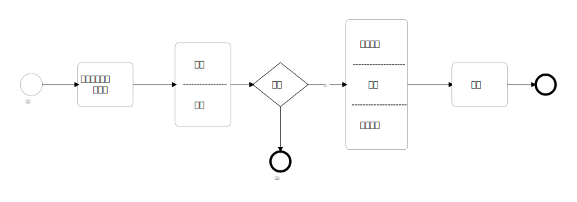

# 强制措施✨✨✨✨

## 对象

犯罪嫌疑人被告人

!!! tip ""
        单位代表人不是被告人，拘传代表人为司法措施

??? tip "群众扭送不是强制措施"
        适合情景：   
        正（犯）及（发觉）在（逃）追越（狱）

## 措施
|名称|决定机关|执行机关|对象|要点|地点|
|-|-|-|-|-|-|
|拘传|3|3|犯罪嫌疑人被告人|12,24h，2名，拘传证，立即询问|嫌疑人所在市县内|
|取保候审|3|1（公安、国安）|不用逮捕者|交钱or保证人（老幼穷）|-|
|监视居住（备胎）|3|1（公安、国安）|逮捕：疾病孕乳唯一抚 特殊需要已超期 取保：没钱又没人|24h通知家属，管制抵1，徒刑0.5（指定居所）|有家就在家每家找个家 危恐该找家|
|（刑事）拘留|2(公检)|1（公安）|有嫌疑|一般7天、多结流30天|当地、异地（当地机关协助）|
|逮捕|2（法检）|1（公安）|危险&证据&徒刑（10y）|-|-|

??? note "人大代表先报告" 
        同级人大 - 直接报同级    
        不同级人大 - 逐级报，最终对等机关报，乡代表由县检报乡人大    
        下级两路报 两级分开报 外地委托报

        拘留已报请 逮捕无需报（只要报一次）   

        现行犯先抓后报告

??? note "外国人先报告" 
        危交难：     
        先报最高检，最高检问外交部

        其他：   
        先批后备案
        批准后48h备案（通知同级外事部门）

??? note "危人报告" 
    危害国家安全检察院都要报上一级备案

---

??? note "拘传与传唤的区别" 
        主体不同：   
        拘传只允许犯罪嫌疑人被告人

        强度不同：   
        拘传不允许口头，传唤没有强制

---

??? note "不用逮捕的情形"
        1. 管制、拘役、独立适用附加刑（徒刑以下）   
        2. 不危险   
        3. 疾病孕乳    
        4. 超（羁押）期限

        例外：累主残暴严（有上述条款的可以）

??? note "保证人要求"
        最多两人，无牵连，有能力，有（政治）权，有（固定）房又有钱

        责任：    
        监督报告否则罚款（1000-2000）、追刑责

??? note "保证金要求"
        1000以上（未成年人500）

        违反规定：没收     
        涉嫌犯罪：暂扣     

??? note "取保候审申请人"
        取保候审：     
        当法近辩  

        **区别**

        申请回避：   
        当法诉辩

??? note "取保候审期限"
        每个机关12个月

??? note "取保候审人要求"
        应当：   
        市县报告及时到 不扰证人不毁证   

        可以：   
        特定的地方特定的人 特点的活动特定的证

        应当逮捕：   
        新罪逃（自）杀串毁证 还要打击报复他

---

??? note "监视居住期限"
        每个机关6个月

??? note "监视居住监督"
        公法决定（同级检察院）捕诉监督 检院决定申诉控告监督   

        公法执行执检监督 检院决定 申诉控告监督

??? note "监视居住要求"
        应当：   
        处所会见及时到 不扰证人不毁证 保存还要身份证

        应当逮捕：
        新罪逃（自）杀串毁证 还要打击报复他

---

??? note "三类拘留区别"
        行政拘留：   
        行政处罚 

        司法拘留：   
        扰乱司法秩序的处罚

        刑事拘留：   
        保证刑诉实施的强制措施

??? note "刑事拘留程序"

        拘留前先行拘留：    
        刑事拘留前可以进行

        **主体**   
        公安：   
        公安权力超级牛 一言不合就带走

        检察院：   
        自杀逃跑在逃的 毁灭证据串供的

        公检老大决定（县级及以上）    

        拘留证   

        24h内任务：   
        送看（守）通知询问    
        危恐可以不

??? note "刑事拘留期限"

        **一下数字均为最长期限**

        公安：   
        3-7天报告批捕，检察院7天批捕    
        流窜结伙多次（30d报告批捕）    

        检察院：   
        7天报告批捕，7-10天内批捕

        监委移送：
        10-14天内决定

---

??? note "逮捕和留置"

        对象：   
        犯罪嫌疑人-被调查人（大复逃杀 毁证其他）

        逮捕公安报同级    
        留置监委报上级

??? note "逮捕程序"
        县以上公安报检察院

        逮捕证

        24h内任务：   
        送看（守）通知询问（谁想谁干）

        上报时间：   
        已经羁押7天内   
        未羁押15天

        批捕前检察官可以讯问，应当询问的情况：    
        疑面（犯罪嫌疑人要求当面）违难加认罚 小孩聋哑半疯傻     
        不询问就逮捕，也要公送检意见书

        检察院不批捕，公安申请检捕诉机关复议

        公安上来的案件中的人，检察院想捕就捕    
        未被拘留的人逮捕要听公安意见

        检察院自行侦察拘留的，7日内侦察部门报送捕诉部门，诉讼部门7日内答复（复杂的可以延长3d），未被拘留15-20天

??? note "羁押必要性检查" 
        在【羁押后】的监督程序   

        当法近辩可申请   

        审查要立案 立案（涉及到刑事强制措施变更）检察长   

        除了涉及秘密隐私都要公开

        应当放人：   
        量刑非羁押 刑期已折抵 羁押已超期    
        
        3无1有    
        1. 无证据条件   
        2. 无危险条件   
        3. 无徒刑   
        

        **主体**
        捕诉部门

        侦察阶段：
        捕诉部门建议公安法院放人